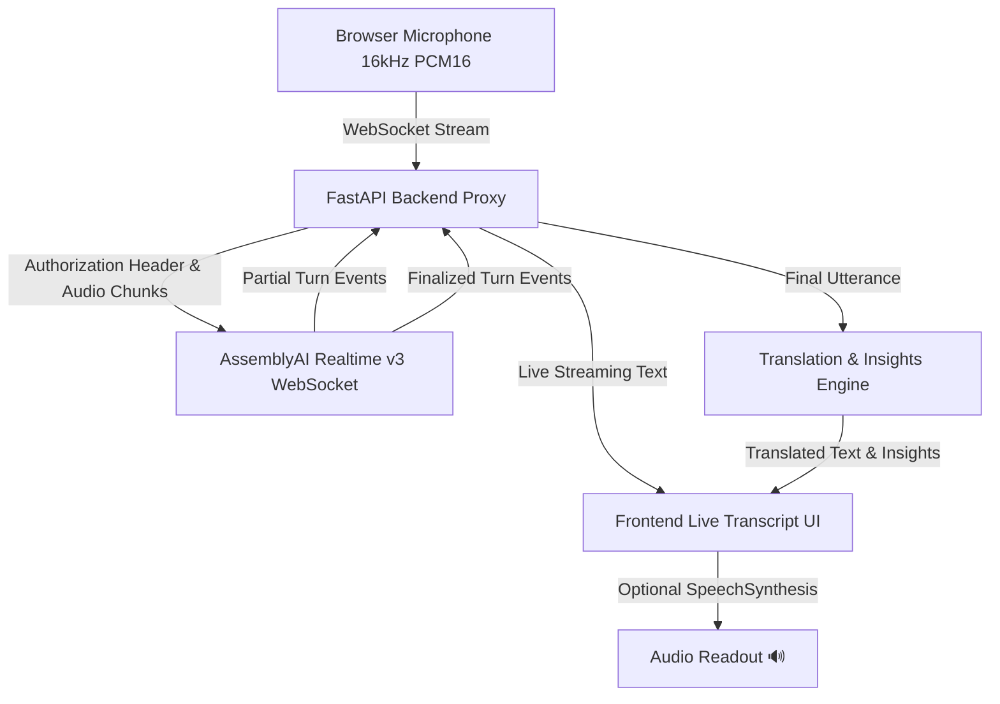

# BridgeTalk 🌐

> **Real-time conversations without language barriers.**

BridgeTalk is a real-time multilingual conversation bridge built for the **lablab.ai × AssemblyAI Hackathon** ("Build voice AI agents on AssemblyAI", September 2026). It enables two people who speak different languages to converse naturally in real time using AssemblyAI Realtime Speech-to-Text technology, instant contextual translation, structured conversation insights, and optional spoken text-to-speech.

---

## 🚀 Problem

In global workplaces, international healthcare settings, cross-border business meetings, and casual social interactions, language barriers prevent fluid, natural human connection. Traditional translation apps rely on slow turn-taking, manual text input, or laggy batch audio processing that disrupts conversational rhythm.

## 💡 Solution

**BridgeTalk** breaks down language barriers by streaming live microphone audio directly to **AssemblyAI Realtime Speech-to-Text**. As a speaker talks in their native tongue (e.g. Hindi), AssemblyAI streams live partial transcripts to the screen. Once an utterance is finalized, BridgeTalk translates it into the listener's target language (e.g. English), extracts structured facts (dates, times, locations, requests), and optionally reads the translation aloud via Text-to-Speech—creating an effortless real-time conversation bridge.

---

## ✨ Key Features

- **⚡ Real-time Speech-to-Text**: Powered by AssemblyAI's latest Realtime v3 WebSocket API.
- **🇮🇳 ↔ 🇬🇧 Multilingual Conversation Bridge**: Initial support for Hindi ↔ English pair, architected for multi-language scalability.
- **🎙️ Streaming Partial Transcripts**: Displays text live as the user speaks before finalizing.
- **🌐 Context-Preserving Translation**: Translates finalized turns accurately while strictly preserving names, dates, times, currencies, and locations.
- **🔊 Optional Spoken Translations**: Spoken audio readout using browser-native SpeechSynthesis.
- **📊 Structured Conversation Insights**: Automatically extracts dates, times, locations, amounts, and topics without AI hallucinations.
- **▶️ Credit-Free Demo Mode**: Built-in interactive demo mode allowing complete UI & translation testing without consuming AssemblyAI API credits.
- **🔒 Enterprise Security**: API keys are isolated on the backend `.env` and never exposed to the frontend browser or git repository.

---

## ⚡ Why AssemblyAI?

AssemblyAI is the core speech recognition intelligence engine of BridgeTalk. The application relies directly on AssemblyAI's **Realtime WebSocket v3 API** (`wss://streaming.assemblyai.com/v3/ws?sample_rate=16000`).

### Realtime Streaming Pipeline:



1. **Low-Latency Streaming**: Raw 16kHz PCM16 audio chunks (50ms–100ms) stream from the browser over WebSocket to AssemblyAI.
2. **Turn Detection**: AssemblyAI emits `Turn` events with `end_of_turn: false` for partial text and `end_of_turn: true` when a natural pause in speech occurs.
3. **Session Safety**: When the user clicks **Stop Conversation**, BridgeTalk sends a clean `{"type": "Terminate"}` payload to AssemblyAI to close the WebSocket session immediately and eliminate unnecessary billing.

---

## 🛠️ Technology Stack

- **Frontend**: React 18, Vite, Modern Vanilla CSS (Dark Glassmorphic design system), Lucide Icons, Web Audio API, Web Speech API (SpeechSynthesis).
- **Backend**: Python 3.10+, FastAPI, Uvicorn, WebSockets (`websockets`), `pydantic-settings`, `python-dotenv`.
- **Speech Recognition**: AssemblyAI Realtime Speech-to-Text API (v3).
- **Translation Engine**: Hosted Groq Qwen 3.8 model for deployment; AssemblyAI is used for real-time speech recognition.
- **Insights Engine**: Regex & NLP factual entity extractor.

---

## 📦 Project Structure

```text
BridgeTalk/
├── frontend/
│   ├── src/
│   │   ├── components/
│   │   │   ├── Header.jsx
│   │   │   ├── ConnectionStatus.jsx
│   │   │   ├── SpeakerSelector.jsx
│   │   │   ├── LiveTranscriptArea.jsx
│   │   │   ├── ConversationList.jsx
│   │   │   ├── InsightsPanel.jsx
│   │   │   ├── Controls.jsx
│   │   │   └── DemoModeBanner.jsx
│   │   ├── hooks/
│   │   │   ├── useAudioRecorder.js
│   │   │   ├── useWebSocket.js
│   │   │   └── useSpeechSynthesis.js
│   │   ├── styles/
│   │   │   └── index.css
│   │   ├── App.jsx
│   │   └── main.jsx
│   ├── package.json
│   └── vite.config.js
├── backend/
│   ├── app/
│   │   ├── main.py
│   │   ├── config.py
│   │   ├── websocket.py
│   │   ├── assemblyai_service.py
│   │   ├── translation_service.py
│   │   ├── insights_service.py
│   │   └── models.py
│   ├── tests/
│   │   ├── test_config.py
│   │   ├── test_translation.py
│   │   ├── test_insights.py
│   │   └── test_websocket.py
│   └── requirements.txt
├── .env.example
├── .gitignore
└── README.md
```

---

## ⚙️ Installation & Setup

### Prerequisites
- Python 3.10 or higher
- Node.js 18 or higher & npm

### 1. Clone & Configure Environment

```bash
git clone https://github.com/your-repo/BridgeTalk.git
cd BridgeTalk
```

Copy `.env.example` to `.env`:

```bash
cp .env.example .env
```

Open `.env` and insert your **AssemblyAI API Key**:

```ini
ASSEMBLYAI_API_KEY=your_actual_assemblyai_api_key
```

Create a Groq API key for hosted translation and add it to the backend environment:

```bash
TRANSLATION_PROVIDER=groq
GROQ_API_KEY=your_groq_api_key
GROQ_MODEL=qwen/qwen3.8-27b
```

For the deployed Render service, add these values under **Environment** in the Render dashboard, then redeploy. Keep the Groq key private and never put it in frontend variables. The free Groq tier has account/model rate limits, so check its dashboard if it returns 429s.

---

### 2. Backend Setup

```bash
# Create virtual environment
python -m venv .venv

# Activate virtual environment
# On Windows (PowerShell):
.venv\Scripts\Activate.ps1
# On macOS/Linux:
source .venv/bin/activate

# Install requirements
pip install -r backend/requirements.txt
```

---

### 3. Frontend Setup

```bash
cd frontend
npm install
cd ..
```

---

## 🏃 Running BridgeTalk

### Optional: local translation during development

To use Ollama locally instead of the hosted provider, install Ollama and pull its Hindi/English-capable model:

```bash
ollama pull llama3.2:3b
```

Set `TRANSLATION_PROVIDER=ollama`; `OLLAMA_BASE_URL` defaults to `http://127.0.0.1:11434` and `OLLAMA_MODEL` defaults to `llama3.2:3b`.

### Start Backend Server

```bash
# From project root with .venv activated:
uvicorn backend.app.main:app --reload --port 8000
```

### Start Frontend Dev Server

```bash
# In a new terminal tab inside frontend directory:
cd frontend
npm run dev
```

Open browser to `http://localhost:3000`.

---

## 🧪 Running Automated Tests

```bash
# Run backend pytest suite
pytest backend/tests/
```

---

## 🎮 How to Use BridgeTalk

1. Open `http://localhost:3000`.
2. Select your active speaker:
   - **Person A**: Speaks Hindi 🇮🇳 (Translates to English)
   - **Person B**: Speaks English 🇬🇧 (Translates to Hindi)
3. Click **Start Conversation** (Allow microphone access when prompted).
4. Speak naturally into your microphone.
5. Watch the **Live Partial Transcript** appear as you speak.
6. When you pause, AssemblyAI finalizes the transcript, BridgeTalk translates it, extracts insights, and displays the turn in the conversation stream.
7. Toggle **Speak translations** to hear target language translations spoken aloud.
8. Switch active speakers seamlessly using **Speak as Person A** or **Speak as Person B**.
9. Click **Stop Conversation** when finished.

---

## ▶️ Running Demo Mode (Credit Safety)

To showcase BridgeTalk without consuming live AssemblyAI API credits:
1. Click **▶ Demo Mode (No Credits)** on the controls bar.
2. Watch the simulated pre-recorded conversation stream partial text, finalize turns, translate between Hindi ↔ English, extract factual insights, and trigger spoken audio.

---

## 🔒 Security Policy

- **No Key Leaks**: `ASSEMBLYAI_API_KEY` resides strictly in the backend `.env` file.
- **Frontend Isolation**: Vite/React code never accesses or transmits secrets.
- **Git Safety**: `.env` is included in `.gitignore` to prevent secret leakage.

---

## 🏆 Hackathon Submission

BridgeTalk was created for the **lablab.ai × AssemblyAI Hackathon** (September 2026).
- **Core Technology**: AssemblyAI Realtime Speech-to-Text API v3.
